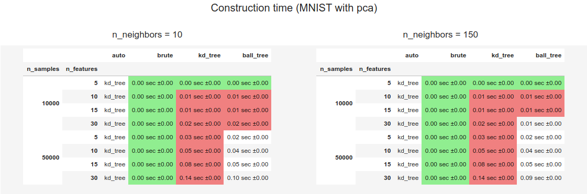
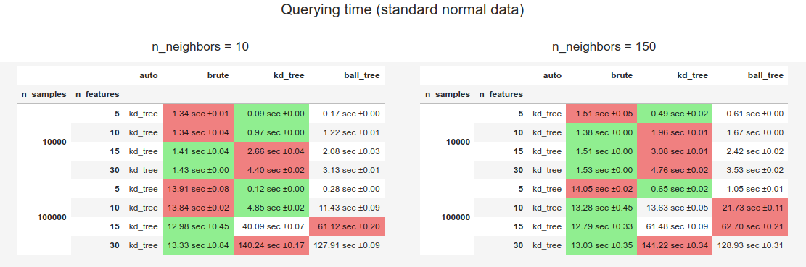
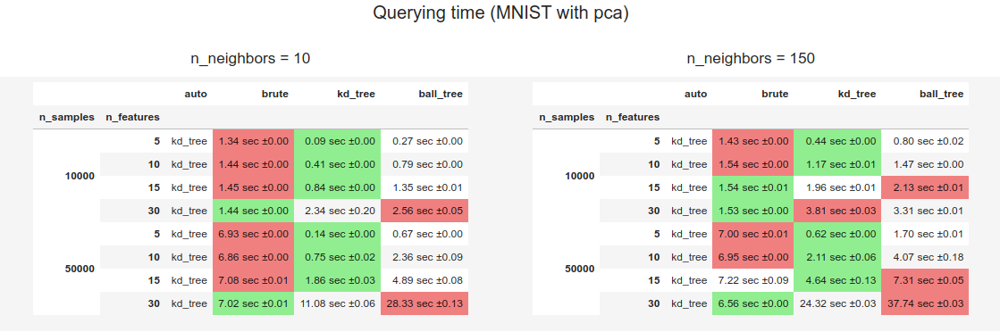
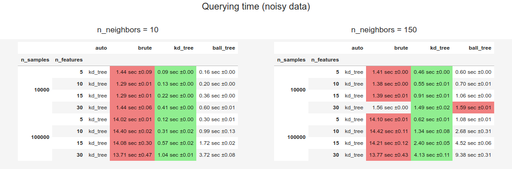
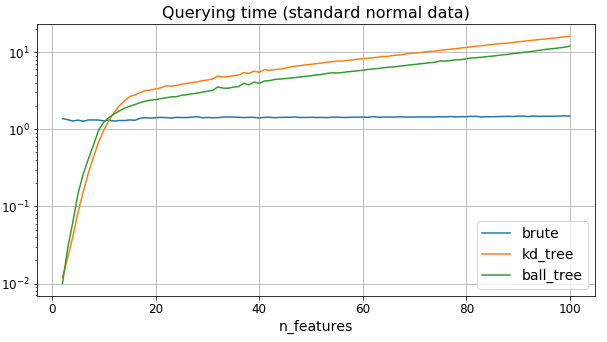
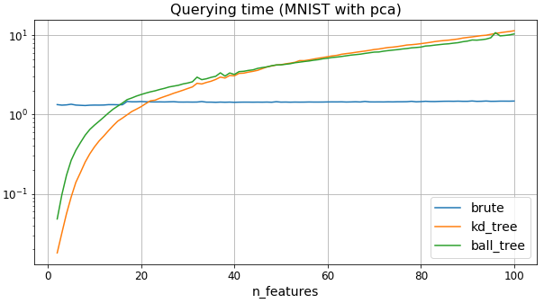
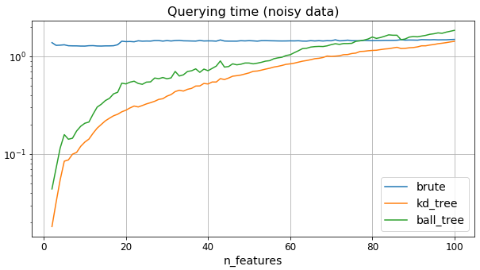

# Scikit-learn nearest neighbors benchmark

This repository contains notebooks for benchmarking scikit-learn [nearest neighbors algorithms](https://scikit-learn.org/dev/modules/neighbors.html#nearest-neighbor-algorithms) (**brute force**, **k-d tree** and **ball tree**). This work intends to study how computation time is impacted by the main factors it depends.

## Context

The number of factors that influence nearest neighbors computation time is quite large. We must also note that those factors can interact together in non-linear ways on the result. Those reasons make the choice of the optimal algorithm not always easy.

To simplify our analysis, we restricted our experiments to the following factors which we consider being the most importants:
- nearest neighbor algorithm (**brute force**, **k-d tree** and **ball tree**)
- data structure (multiple datasets with differents intrinsic dimensionality and level of sparsity)
- `n_samples` (at construction time)
- `n_features`
- `n_neighbors`

Querying running time depends linearly from the number of query points. In order to get robust results we thus fixed it to a large enough number (10,000). For simplicity again, only euclidean metric has been used.

Since studied factors interact in non-linear ways we relied on tables instead of plots to present most of the results. Only `n_features` has been plot with other parameters kept constant (`n_samples`=10,000 and `n_neighbors`=10) because in the regular case it often acts as the major factor regarding the choice of the optimal algorithm.

## Benchmark notebooks

Notebooks are organized per dataset used:
- [MNIST](https://nbviewer.jupyter.org/github/gbolmier/sklearn-neighbors-benchmark/blob/master/benchmark_sn_data.ipynb): MNIST with PCA applied
- [Synthetic noisy data](https://nbviewer.jupyter.org/github/gbolmier/sklearn-neighbors-benchmark/blob/master/benchmark_sn_data.ipynb): 5 standard normal sampled features and remaining features being random linear combinations of them
- [Synthetic standard normal data](https://nbviewer.jupyter.org/github/gbolmier/sklearn-neighbors-benchmark/blob/master/benchmark_sn_data.ipynb): standard normal sampled features

## Results (sklearn=0.22.2.post1)

Unlike **brute force**, both **k-d tree** and **ball tree** require a construction phase. This latter is generally faster of at least one order of magnitude compared to querying stage. For practical reasons, we are thus more interested in inference time.

### Construction phase results

  

Naturally, construction phase isn't impacted by `n_neighbors`, the small differences we can observe here are due to the variance of the runs. One thing to notice is that **ball tree** tree construction is slightly faster than **k-d tree**'s.

### Querying phase results

  

  

  

Observations:
- **Ball tree** is never the fastest algorithm
- **Brute force** is mainly impacted by `n_samples` and not significantly by `n_features` and `n_neighbors`
- Tree based methods are faster with lower dataset intrinsic dimensionality and with higher dataset sparsity
- Tree based methods are more efficient than **brute force** when `n_features` isn't too high. Treshold mostly depends of the data structure and with a smaller impact from `n_samples` and `n_neighbors`
- The higher `n_neighbors` is in proportion to `n_samples` and `n_features` the slower tree based methods are

  

  

  

## Resources

- [Scikit-learn user guide - nearest neighbor algorithms](https://scikit-learn.org/dev/modules/neighbors.html#nearest-neighbor-algorithms)
- [Jake Vanderplas benchmark](https://jakevdp.github.io/blog/2013/04/29/benchmarking-nearest-neighbor-searches-in-python/) 04/2013
- [Erik Bernhardsson benchmark](https://github.com/erikbern/ann-benchmarks)
